# ZCL_DOCX_CLASS Замена для ZWWW

Простой пример. 

Такой подход применяется для формуляров, имеющих фиксированную структуру.

Объявляем в шаблоне переменные в фигурных скобках {name} {date} {time}.

Это ридми, оно же шаблон для тестовой программы(то которое readme.docx ).   

Сохраняем, грузим в транзакцию smw0 . 


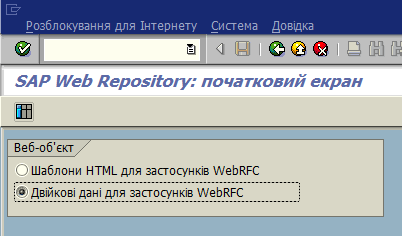


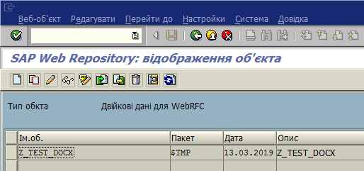


Программа 


```
REPORT z_test_docx.
** тут класс
INCLUDE zcl_docx_class.

START-OF-SELECTION.

  DATA
        : lo_docx TYPE REF TO lcl_docx
        , lr_data TYPE REF TO lcl_recursive_data
        .


  CREATE OBJECT lr_data.

  lr_data->append_key_value( iv_key = 'name' iv_value = sy-uname ).
  lr_data->append_key_value( iv_key = 'date' iv_value = |{ sy-datum  DATE = ENVIRONMENT }| ).
  lr_data->append_key_value( iv_key = 'time' iv_value = |{ sy-uzeit TIME = ENVIRONMENT  }| ).


  CREATE OBJECT lo_docx .

  lo_docx->load_smw0( 'Z_TEST_DOCX' ).

  lo_docx->map_data( EXPORTING ir_data = lr_data ).

  CALL METHOD lo_docx->save
    EXPORTING
      on_desktop   = 'X'
      iv_folder    = 'report'
      iv_file_name = 'report.docx'
      no_execute   = ''.
```

Усложним пример.
В формуляре есть таблица.


<table>
  <tr>
   <td>

Код авіакомпанії
   </td>
   <td>Код авиасообщения
   </td>
   <td>Дата рейса
   </td>
   <td>Цена рейса
   </td>
  </tr>
  <tr>
   <td>{CARRID}
   </td>
   <td>{CONNID}
   </td>
   <td>{FLDATE}
   </td>
   <td><p style="text-align: right">
{PRICE}</p>

   </td>
  </tr>
</table>


Выделяем вторую строку (в которой будут данные) и добавляем метку 


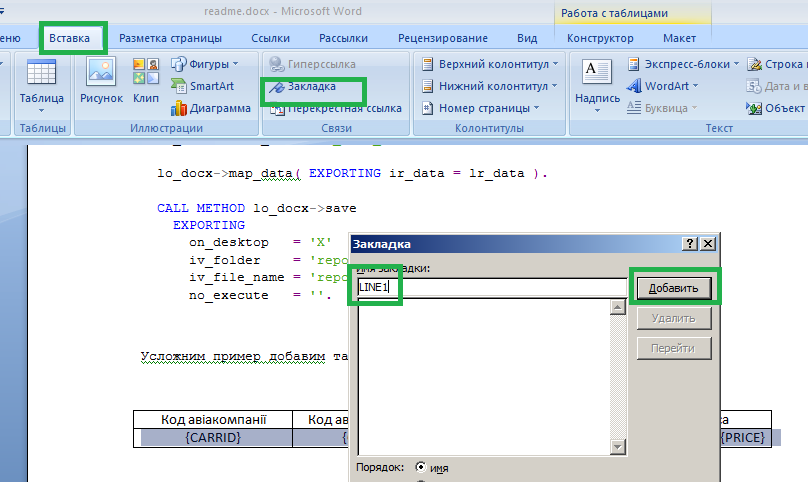


Сохраняем, и нам нужно будет кое-что подправить ручками в шаблоне, потому что у ворда свое представление о том, как расставлять метки.

Далее нам понадобятся следующие инструменты:


1. 7zip [http://7zip.org/](http://7zip.org/)
2. Notepad++ [https://notepad-plus-plus.org/download/v7.5.4.html](https://notepad-plus-plus.org/download/v7.5.4.html)
3. Notepad ++ xml plugin [https://sourceforge.net/projects/npp-plugins/files/XML%20Tools/Xml%20Tools%202.4.9%20Unicode/](https://sourceforge.net/projects/npp-plugins/files/XML%20Tools/Xml%20Tools%202.4.9%20Unicode/)

В скачанном архиве плагина Notepad ++ xml plugin  будет вполне понятное readme как его установить.

Можно руками распаковывать и запаковывать шаблон, можно воспользоваться файлом 123.bat

Первый запуск распаковывает последний документ ворд в папке, второй запуск - запаковывает.

Без использования 123.bat, вам нужно будет распаковать вордовский документ с помощью программы 7zip. 

Идем в появившуюся папку, папка word, файл document.xml 

Открываем с помощью notepad++, приводим в читаемый вид.


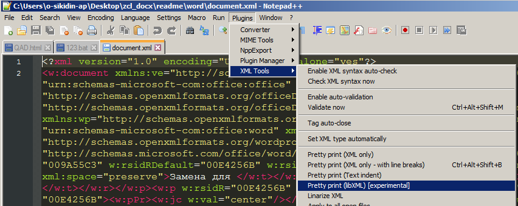


Ctrl+f -> book -> find all in curent document .

Мы  видим 2 тега


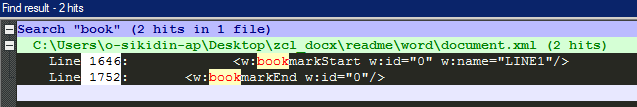


Открывающий bookmarkStart и закрывающий BookmarkEnd 

Открывающий и закрывающий теги связаны по параметру id, открывающий подписан.

Строка таблицы открывается тегом <w:tr> и закрывается тегом </w:tr>

BookmarkEnd стоит после того как строка таблицы закрылась 


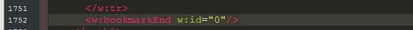


И открывающий стоит после того как строка открылась 

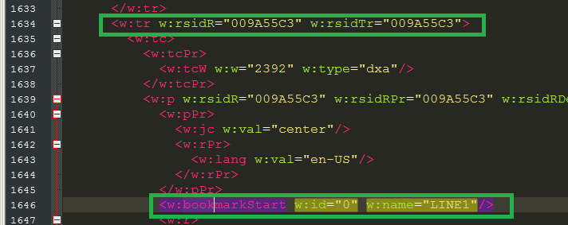


Когда строки размножаются, то берется все что между тегами bookmarkStart и bookmarkEnd и повторяется сколько нужно раз. Для того  чтоб в итоговом документе вложенность тегов не была нарушена, тег bookmarkStart  нужно перенести до начала строки.


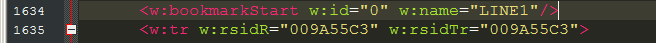


Сохраняем, запаковываем, загружаем шаблон. 

Если мы добавили в документ метки для таблицы, то после каждого пересохранения документа средствами офиса, описанные выше действия нужно будет повторить.

Пишем программу.

```

  DATA
        : lt_sflight TYPE TABLE OF sflight

        .


  SELECT *
    INTO TABLE lt_sflight
    UP TO 5 ROWS
    FROM sflight.


  lr_data->append_key_table( iv_key = 'line1' iv_table  = lt_sflight ).
```


Переходим к третьему уровню сложности - таблицы таблиц.

{CARRID1}


<table>
  <tr>
   <td>Код авіакомпанії
   </td>
   <td>Код авиасообщения
   </td>
   <td>Дата рейса
   </td>
   <td>Цена рейса
   </td>
  </tr>
  <tr>
   <td>{CARRID}
   </td>
   <td>{CONNID}
   </td>
   <td>{FLDATE}
   </td>
   <td><p style="text-align: right">
{PRICE}</p>

   </td>
  </tr>
</table>


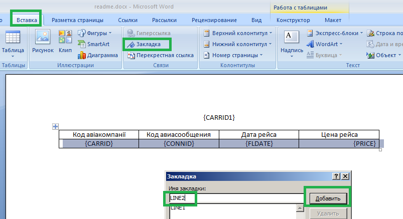


Теперь, выделяем все это вместе и добавляем еще одну закладку.


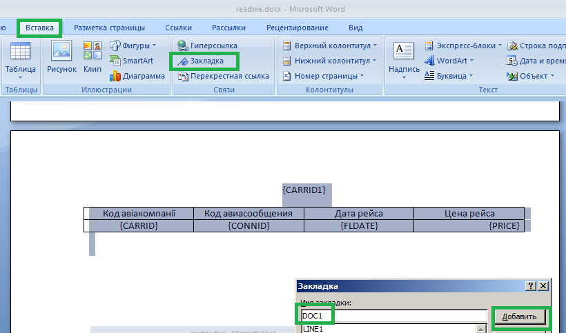


Сохраняем, распаковываем, переставляем метки, запаковываем.

У нас будет документ, внутри которого таблица,

Мы видим, что наша метка начинается внутри абзаца.


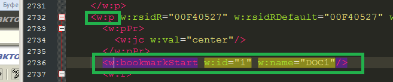


А заканчивается за его пределами 


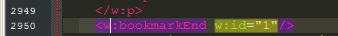


Открывающий тег нужно перенести до начала абзаца.


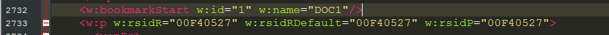


Смотрим, что с нашей таблицей, открывающий тег внутри строки. 


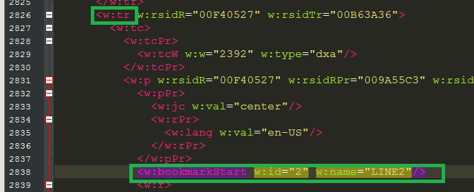


А закрывающий, после конца строки таблицы.


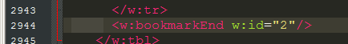


Открывающий тег переносим  перед началом строки .

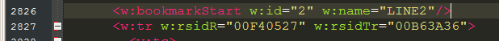


Сохраняем, запаковываем, загружаем. 

Программа.


```
  DATA
        :  lt_carrid  TYPE TABLE OF s_carr_id
        ,  lt_sflight1 TYPE TABLE OF sflight
        ,  lr_doc TYPE REF TO lcl_recursive_data
        .

  SELECT DISTINCT carrid INTO TABLE lt_carrid
    UP TO 5 ROWS
    FROM sflight.

  LOOP AT lt_carrid ASSIGNING FIELD-SYMBOL(<fs_carrid>).

    REFRESH lt_sflight1.

    SELECT * INTO TABLE lt_sflight1
      FROM  sflight
      UP TO 5 ROWS
      WHERE carrid = <fs_carrid>.

    lr_doc = lr_data->create_document( 'DOC1' ).

    lr_doc->append_key_value( iv_key = 'carrid1' iv_value = <fs_carrid> ).
    lr_doc->append_key_table( iv_key = 'line2' iv_table = lt_sflight1 ).


  ENDLOOP.
```


В объект lr_data мы вставили объект lr_doc ,  уровень вложенности неограниченый. 

После каждого пересохранения средствами ворда метки нужно переставить.

Если вы не вносили изменений в документ, то можно загрузить этот документ в систему и посмотреть как работает тестовая программа.

