# Best way to create Microsoft Word docx from ABAP.

Maybe, this video instruction explain better than me.

Watch in 1080p.

[](http://www.youtube.com/watch?v=iScstHjoQ4U "Best way to create Microsoft Word docx from ABAP.")


Installation:
Install package via ABAPGIT  https://docs.abapgit.org/guide-install.html

 
 


 
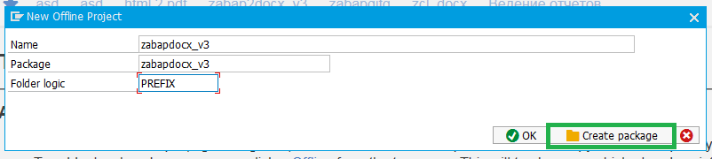 

 
 

 
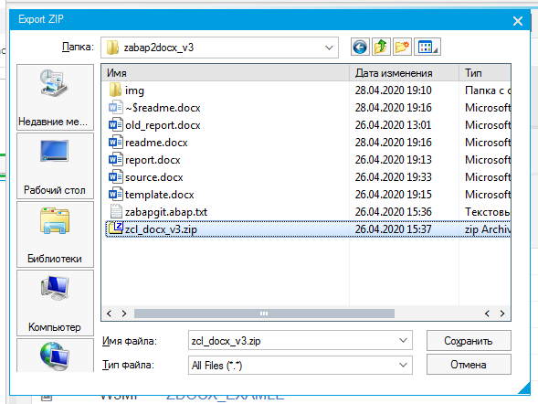 


 
 


For example, the following document should be created:
 
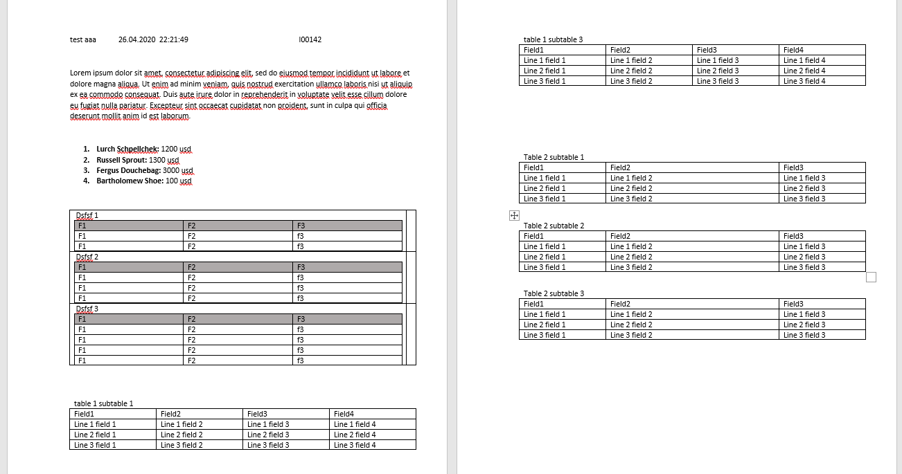 


At first toggle developer toolbar.
File -> Options -> Customize ribbon

 

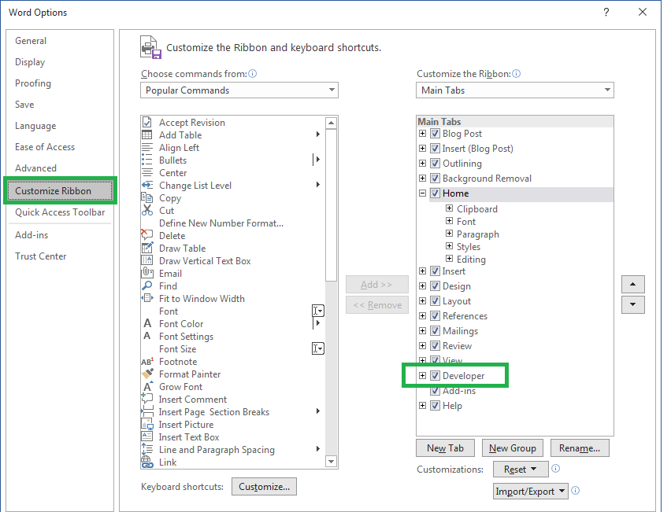 

Go to developer tab, turn on “design mode”.
 
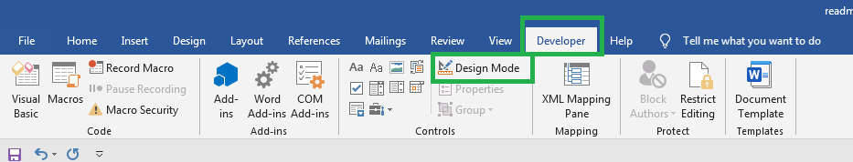 

Select text that will be replaced.
 
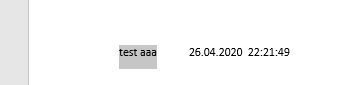 

 Make tag.
 
 


Click properties.
 
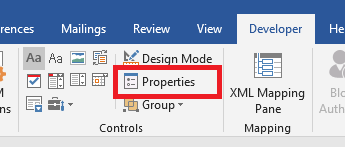 


Enter tag name.

 
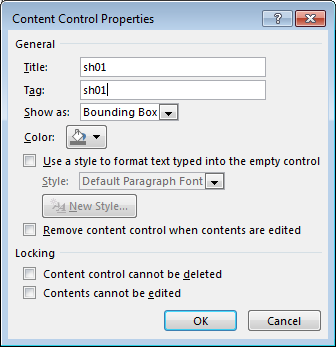 


Repeat for all variable.
For repeated rows or text fragment - select row or text fragment, make repeated control.


 
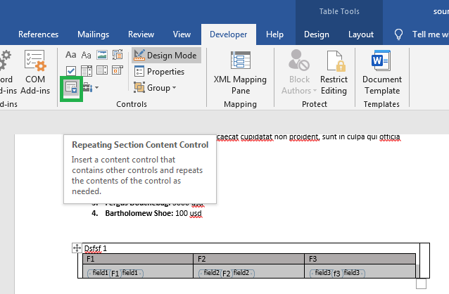 

To enter properties of repeated control place cursor in the begin or end control.

 
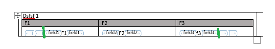 

Tag all variables and repeated part.
Save document. Go to transaction smw0 Select Binary data, enter.


 
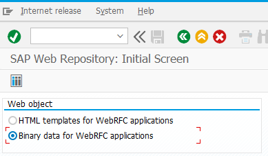 

Object name zdocx_example
 
 

 
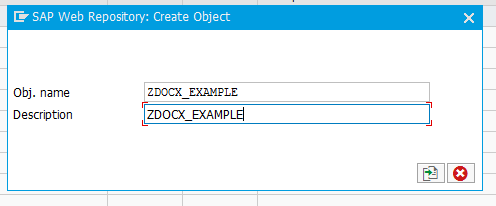 


 
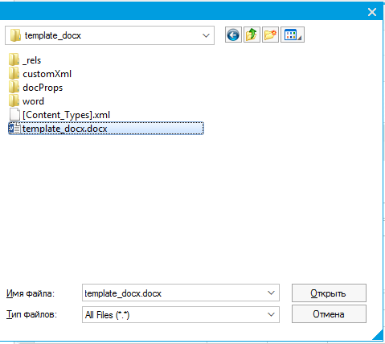 


 
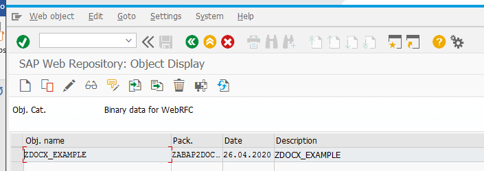 


Go to se38.
Program ZDOCX_GET_TYPES.
Navigate to your template.

 
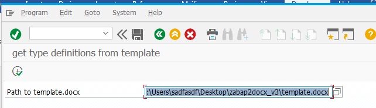 


Run.
Program generate data types, based on your document structure.

 
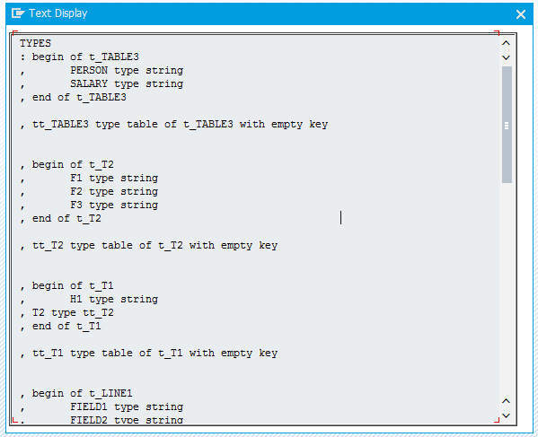 

Copy to your program.
Define variable.

```
Data
: gs_templ_data TYPE t_data
.
```

Fill structure with your data.
Then get document.

```

zcl_docx3=>get_document(
    iv_w3objid    = 'ZDOCX_EXAMLE'   " name of our template
*      iv_template   = ''            " you can feed template as xstring instead of load from smw0
*      iv_folder     = 'report'      " in folder by default 'report'
*      iv_path       = ''            " IF iv_path IS INITIAL  save on desctop or sap_tmp folder
*      iv_file_name  = 'report.docx' " file name by default
*      iv_no_execute = ''            " if filled -- just get document no run office
*      iv_protect    = ''            " if filled protect document from editing, but not protect from sequence
                                   " ctrl+a, ctrl+c, ctrl+n, ctrl+v, edit
    iv_data       = gs_templ_data  " root of our data, obligatory
*      iv_no_save    = ''            " just get binary data not save on disk
    ).
```

 
Whole program “ZDOCX_EXAMPLE”:
```
*&---------------------------------------------------------------------*
*& Report ZDOCX_EXAMPLE
*&---------------------------------------------------------------------*
*&
*&---------------------------------------------------------------------*
REPORT zdocx_example.

*describe types

TYPES
: begin of t_TABLE3
,       PERSON type string
,       SALARY type string
, end of t_TABLE3

, tt_TABLE3 type table of t_TABLE3 with empty key


, begin of t_T2
,       F1 type string
,       F2 type string
,       F3 type string
, end of t_T2

, tt_T2 type table of t_T2 with empty key


, begin of t_T1
,       H1 type string
, T2 type tt_T2
, end of t_T1

, tt_T1 type table of t_T1 with empty key


, begin of t_LINE1
,       FIELD1 type string
,       FIELD2 type string
,       FIELD3 type string
,       FIELD4 type string
, end of t_LINE1

, tt_LINE1 type table of t_LINE1 with empty key


, begin of t_TAB1
,       TITLE1 type string
, LINE1 type tt_LINE1
, end of t_TAB1

, tt_TAB1 type table of t_TAB1 with empty key


, begin of t_LINE2
,       FIELD1 type string
,       FIELD2 type string
,       FIELD3 type string
, end of t_LINE2

, tt_LINE2 type table of t_LINE2 with empty key


, begin of t_TAB2
,       TITLE2 type string
, LINE2 type tt_LINE2
, end of t_TAB2

, tt_TAB2 type table of t_TAB2 with empty key


, begin of t_data
,       SH01 type string
,       DATE type string
,       TIME type string
,       USER type string
, TABLE3 type tt_TABLE3
, T1 type tt_T1
, TAB1 type tt_TAB1
, TAB2 type tt_TAB2
, end of t_data

, tt_data type table of t_data with empty key


.


*some variable
DATA
      : gs_templ_data TYPE t_data
      , lv_index TYPE i
      , lv_index2 TYPE i
      , lv_index3 TYPE i
      .


*fill data

gs_templ_data-DATE = |{ sy-datum date = environment }|.
gs_templ_data-TIME = |{ sy-uzeit   TIME = ENVIRONMENT }|.
gs_templ_data-USER  = sy-uname.


*1.  Lurch Schpellchek: 1200 usd
*2.  Russell Sprout: 1300 usd
*3.  Fergus Douchebag: 3000 usd
*4.  Bartholomew Shoe: 100 usd

APPEND INITIAL LINE TO gs_templ_data-table3 ASSIGNING FIELD-SYMBOL(<ls_3>).
<ls_3>-person = 'Lurch Schpellchek'.
<ls_3>-salary = '1200'.

APPEND INITIAL LINE TO gs_templ_data-table3 ASSIGNING <ls_3>.
<ls_3>-person = 'Russell Sprout'.
<ls_3>-salary = '1300'.

APPEND INITIAL LINE TO gs_templ_data-table3 ASSIGNING <ls_3>.
<ls_3>-person = 'Fergus Douchebag'.
<ls_3>-salary = '3000'.

APPEND INITIAL LINE TO gs_templ_data-table3 ASSIGNING <ls_3>.
<ls_3>-person = 'Bartholomew Shoe'.
<ls_3>-salary = '100'.


gs_templ_data-sh01 = 'test aaa'.

DO 3 TIMES.
  lv_index = sy-index.

  APPEND INITIAL LINE TO gs_templ_data-tab1 ASSIGNING FIELD-SYMBOL(<ls_tab1>).
  <ls_tab1>-title1 = |table 1 subtable { lv_index }|.


  DO 3  TIMES.
    lv_index2 = sy-index.
    APPEND INITIAL LINE TO <ls_tab1>-line1 ASSIGNING FIELD-SYMBOL(<ls_line1>).

    DO 4 TIMES.
      lv_index3 = sy-index.

      ASSIGN COMPONENT lv_index3 OF STRUCTURE <ls_line1> TO FIELD-SYMBOL(<fs_any>).

      <fs_any> = |Line { lv_index2  } field { lv_index3 }|.

    ENDDO.


  ENDDO.


ENDDO.


DO 3 TIMES.
  lv_index = sy-index.

  APPEND INITIAL LINE TO gs_templ_data-tab2 ASSIGNING FIELD-SYMBOL(<ls_tab2>).
  <ls_tab2>-title2 = |Table 2 subtable { lv_index }|.


  DO 3  TIMES.
    lv_index2 = sy-index.
    APPEND INITIAL LINE TO <ls_tab2>-line2 ASSIGNING FIELD-SYMBOL(<ls_line2>).

    DO 3 TIMES.
      lv_index3 = sy-index.

      ASSIGN COMPONENT lv_index3 OF STRUCTURE <ls_line2> TO <fs_any>.

      <fs_any> = |Line { lv_index2  } field { lv_index3 }|.

    ENDDO.


  ENDDO.


ENDDO.

gs_templ_data = VALUE #( BASE gs_templ_data
  t1 = VALUE #(
    ( h1 = |1| t2 = VALUE #(
        ( f1 = 'F1' f2 = 'F2' f3 = 'f3' )
        ( f1 = 'F1' f2 = 'F2' f3 = 'f3' )
      )
    )
    ( h1 = |2| t2 = VALUE #(
        ( f1 = 'F1' f2 = 'F2' f3 = 'f3' )
        ( f1 = 'F1' f2 = 'F2' f3 = 'f3' )
        ( f1 = 'F1' f2 = 'F2' f3 = 'f3' )
      )
    )
    ( h1 = |3| t2 = VALUE #(
        ( f1 = 'F1' f2 = 'F2' f3 = 'f3' )
        ( f1 = 'F1' f2 = 'F2' f3 = 'f3' )
        ( f1 = 'F1' f2 = 'F2' f3 = 'f3' )
        ( f1 = 'F1' f2 = 'F2' f3 = 'f3' )
      )
    )
  )
).


*get document

DATA
       : lv_document TYPE xstring  " variable to hold generated document, can be omitted
       .

*first case:  send document as attachment

lv_document = zcl_docx3=>get_document(
    iv_w3objid    = 'ZDOCX_EXAMLE'
    iv_data       = gs_templ_data
    iv_no_save    = 'X'   ).

PERFORM send_document_as_attachment USING lv_document.


*second case: save on desctop and open document

zcl_docx3=>get_document(
    iv_w3objid    = 'ZDOCX_EXAMLE'   " name of our template
*      iv_template   = ''            " you can feed template as xstring instead of load from smw0
*      iv_on_desktop = 'X'           " by default save document on desktop
*      iv_folder     = 'report'      " in folder by default 'report'
*      iv_path       = ''            " IF iv_path IS INITIAL  save on desctop or sap_tmp folder
*      iv_file_name  = 'report.docx' " file name by default
*      iv_no_execute = ''            " if filled -- just get document no run office
*      iv_protect    = ''            " if filled protect document from editing, but not protect from sequence
                                   " ctrl+a, ctrl+c, ctrl+n, ctrl+v, edit
    iv_data       = gs_templ_data  " root of our data, obligatory
*      iv_no_save    = ''            " just get binary data not save on disk
    ).


FORM send_document_as_attachment USING iv_doc TYPE xstring.

*  implement sending here
  MESSAGE 'Doc sended' TYPE 'S'.
ENDFORM.
```

 
