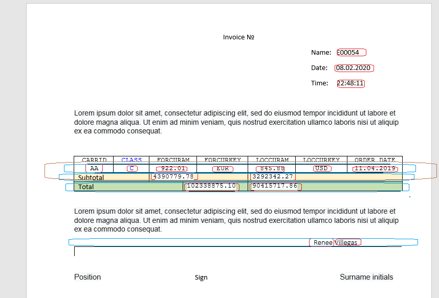
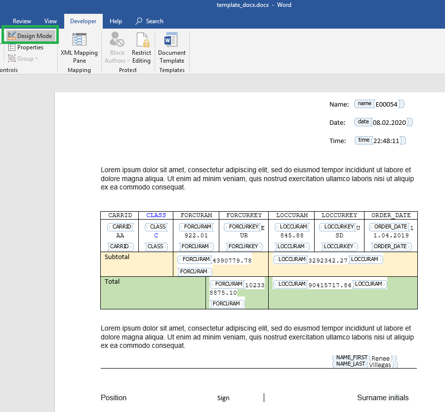
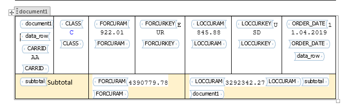
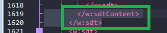

#Tool to create Microsoft Word docx from abap.


Installation
Install package via ABAPGIT https://docs.abapgit.org/guide-install.html
  
  
  
  
  
    
    
  

Where there are mistakes, just click Pull_zip twice.

For example, the following document should be created:
  
  

Initially, define variables and repeated parts  
  
 
Variable – simple text.
Table line – contains table row that may consist of several or zero variables and text.
Document – contain several or zero texts, variables, table row.

We have something like this   
  

Let reduce our document
  
  
 
Structure of data for our document shoudt be like 
├── name  
├── date  
├── time  
├── document1  
│   ├── data_row  
│   │   ├── CARRID  
│   │   ├── CLASS  
│   │   ├── FORCURAM  
│   │   ├── LOCCURAM  
│   │   ├── LOCCURKEY  
│   │   └── ORDER_DATE  
│   │    .  
│   │    .  
│   ├── data_row  
│   │   ├── CARRID  
│   │   ├── CLASS  
│   │   ├── FORCURAM  
│   │   ├── LOCCURAM  
│   │   ├── LOCCURKEY  
│   │   └── ORDER_DATE  
│   └── subtotal  
│       ├── FORCURKEY  
│       └── LOCCURAM  
│    .  
│    .  
├── document1  
│   ├── data_row  
│   │   ├── CARRID  
│   │   ├── CLASS  
│   │   ├── FORCURAM  
│   │   ├── LOCCURAM  
│   │   ├── LOCCURKEY  
│   │   └── ORDER_DATE  
│   │    .  
│   │    .  
│   ├── data_row  
│   │   ├── CARRID  
│   │   ├── CLASS  
│   │   ├── FORCURAM  
│   │   ├── LOCCURAM  
│   │   ├── LOCCURKEY  
│   │   └── ORDER_DATE  
│   └── subtotal  
│       ├── FORCURKEY  
│       └── LOCCURAM  
├── total   
│   ├── FORCURKEY  
│   └── LOCCURAM  
├── sign  
│   ├── NAME_FIRST   
│   └── NAME_LAST  
│   .  
│   .  
└── sign      
    ├── NAME_FIRST  
    └── NAME_LAST  
  
   
Or simple

├── name  (value)  
├── date  (value)  
├── time  (value)  
├── document1   (document repeated)  
│   ├── data_row  (table repeated)  
│   │   ├── CARRID  
│   │   ├── CLASS  
│   │   ├── FORCURAM  
│   │   ├── LOCCURAM  
│   │   ├── LOCCURKEY  
│   │   └── ORDER_DATE  
│   └── subtotal (table of 1 row)  
│       ├── FORCURKEY  
│       └── LOCCURAM  
├── total (table of 1 row)  
│   ├── FORCURKEY  
│   └── LOCCURAM  
└── sign    (table repeated)  
    ├── NAME_FIRST  
    └── NAME_LAST  
  
  
Let sign variable placeholder.

At first toggle developer toolbar. https://www.google.com/search?q=microsoft+office+16+toggle+developer+toolbar

Select  
  
Make tag  
  


Click properties   
  

Enter tag name  
  

Tag name is case insensitive; all the way, it will be converted to uppercase

Value can have any tag name, value inside table row must have name of field of row structure 
For example,  tag name for sign row    
  

Name all variable placeholder
In design time it must look like this    
  


At second we mark placeholder for table row(data_row, subtotal, total, sign)
Place mouse cursor to the left of row   
  

Click   
    
  

Properties, data_row  
  

Subtotal  
  

Total  
  

Sign  
  

Then template in design mode must look like  
  

Now, we move on to the task with an asterisk. In 99% cases you do not need this. I just show opportunity how to make more complex document.
If you want, you can make infinite depth of your document.
We need join 2 rows in one placeholder. Unfortunately, Microsoft Office cannot make placeholder for 2 rows. It can make placeholder for one row or for a whole table.

There we have 2 way:
1)	Cheap and wrong
2)	More complex and True

First way:

Copy your table 3 times   
  

Cut unnecessary part from each table   
  

Make placeholder for whole second table  
  


Remove spaces between tables
In my case, it look like  
  

I don’t like this, maybe, I cannot work with tables.

Second way I prefer:
Select two rows, make placeholder. Office create placeholder for first row. It is ok.  
  
  
  

Now, save the template, close office.

Rename template.docx to template.zip  
    
  

Unpack to subfolder  
  

Navigate inside, then in subfolder ‘word’   
  

We need notepad++ https://notepad-plus-plus.org/downloads/

Open document.xml with notepad++   
  

Navigate plugin->plugins admin..  
  

Search “Xml tools”  
  

Install
Now you can pretty print xml document  
  
  
  

Find placeholder we created. In our case it document2  
  
Ctrl+f
  
  

We can see our placeholder
<w:tag w:val="document2"/>  
  

It starts in line 1293 with tag <w:sdt>

Collapse tree to see where it end  
  

It end near line 1621  
  

Now collapse next placeholder to see where it ends  
  

It ends near line  1757   
  

Expand all.
Go to line 1621
Cut 2 lines  1619, 1620   
  

        </w:sdtContent>
      </w:sdt>  
  

Navigate to line 1757  
  

Insert 2 lines before line 1757  
  

Yellow – inserted lines.

Save, close.

Navigate 1 level up   
    
  

Select all file at this level, add to zip archive   
    
  

Rename template_docx.zip to template_docx.docx

Now we can see placeholder hold 2 rows  
  

Go to transaction smw0
Select Binary data, enter  
  
Object name                     Z_TEST_DOCX2
  
  
Create  
    
  
  
  

Now let’s create test program.

You can read this program with comments or see program Z_TEST_DOCX2 that already exists in the package.
Template Z_TEST_DOCX2 also exists in the package

```
*&---------------------------------------------------------------------*
*& Report Z_TEST_DOCX_2
*&---------------------------------------------------------------------*
*--------------------------------------------------------------------*
*  Autor: Anton.Sikidin@gmail.com
*--------------------------------------------------------------------*

REPORT z_test_docx_2.

START-OF-SELECTION.


  TYPES
"  structure to hold our data
  : BEGIN OF t_data
  ,   carrid  TYPE s_carr_id
  ,   class  TYPE s_class
  ,   forcuram  TYPE s_f_cur_pr
  ,   forcurkey  TYPE s_curr
  ,   loccuram  TYPE s_l_cur_pr
  ,   loccurkey  TYPE s_currcode
  ,   order_date  TYPE s_bdate
  , END OF t_data
  .


  DATA
        : lt_carrid TYPE TABLE OF s_carr_id
        , lt_total TYPE TABLE OF t_data
        , lt_sub_total TYPE TABLE OF t_data
        , lt_sub_total_tmp TYPE TABLE OF t_data
        , lt_data TYPE TABLE OF t_data
        , lt_tmp TYPE TABLE OF t_data

        , lt_adrp TYPE TABLE OF adrp

        .

  " select data for "sign" placeholder
  SELECT * INTO TABLE lt_adrp FROM adrp UP TO 5 ROWS.

*  REFRESH lt_adrp.
*
*
*  APPEND INITIAL LINE TO lt_adrp ASSIGNING FIELD-SYMBOL(<fs_adrp>).
*  <fs_adrp>-name_first = 'Renee'.
*  <fs_adrp>-name_last = 'Villegas'.
*  APPEND INITIAL LINE TO lt_adrp ASSIGNING <fs_adrp>.
*
*  <fs_adrp>-name_first = 'Meerab'.
*  <fs_adrp>-name_last = 'Finnegan'.
*  APPEND INITIAL LINE TO lt_adrp ASSIGNING <fs_adrp>.
*
*  <fs_adrp>-name_first = 'Jozef'.
*  <fs_adrp>-name_last = 'Beil'.
*  APPEND INITIAL LINE TO lt_adrp ASSIGNING <fs_adrp>.
*
*  <fs_adrp>-name_first = 'Leonard'.
*  <fs_adrp>-name_last = 'Yates'.
*  APPEND INITIAL LINE TO lt_adrp ASSIGNING <fs_adrp>.
*
*  <fs_adrp>-name_first = 'Kyron'.
*  <fs_adrp>-name_last = 'Stevens'.


  " select data to display in main table,
  " may be it may create in easy and in proper way,
  " but now it just data for proof of concept

  SELECT *
    INTO CORRESPONDING FIELDS OF TABLE lt_tmp
    FROM sbook
    .

  lt_data = lt_tmp. "make backup, because our data corrupted, while calculate total and subtotal

  LOOP AT lt_tmp ASSIGNING FIELD-SYMBOL(<fs_tmp>).
    COLLECT <fs_tmp>-carrid INTO lt_carrid.  " every document1 or document2 hold data by single carrid

    CLEAR
    : <fs_tmp>-class
    , <fs_tmp>-forcurkey
    , <fs_tmp>-loccurkey
    , <fs_tmp>-order_date
    .

    COLLECT <fs_tmp> INTO lt_sub_total . "calculate  subtotal

    CLEAR
    : <fs_tmp>-carrid
    .

    COLLECT <fs_tmp> INTO lt_total. " calculate total.

  ENDLOOP.


  lt_tmp = lt_data.

  REFRESH lt_data.

  LOOP AT lt_sub_total ASSIGNING FIELD-SYMBOL(<fs_sub_total>).

    DATA
          : lv_i TYPE i
          .
    CLEAR lv_i.

    LOOP AT lt_tmp ASSIGNING <fs_tmp> WHERE carrid = <fs_sub_total>-carrid.
      ADD 1 TO lv_i.

      IF lv_i > 4 . " four row for proof of concept is enought
        EXIT.
      ENDIF.

      APPEND <fs_tmp> TO lt_data.

    ENDLOOP.

  ENDLOOP.


  " craete main wariable to hold our data
  DATA(lr_data) = zcl_docx2=>create_data( ).


  " fill place holder for simple variable, iv_key case insensitive
  lr_data->append_key_value(  iv_key = 'name' iv_value = sy-uname ).
  lr_data->append_key_value(  iv_key = 'date' iv_value = |{ sy-datum DATE = ENVIRONMENT }| ).
  lr_data->append_key_value(  iv_key = 'time' iv_value = |{ sy-uzeit TIME = ENVIRONMENT }| ).

  " fill place holder for total ( table of 1 row)
  lr_data->append_key_table( iv_key = 'total' iv_table = lt_total ).

  "fill  placeholder for sign, iv_key always case insensitive
  lr_data->append_key_table( iv_key = 'sign' iv_table = lt_adrp ).


  " fill our main table

  LOOP AT lt_sub_total ASSIGNING <fs_sub_total>.

    REFRESH
    : lt_tmp
    , lt_sub_total_tmp
    .

    APPEND <fs_sub_total> TO lt_sub_total_tmp. " subtotal table of 1 row
    LOOP AT lt_data ASSIGNING FIELD-SYMBOL(<fs_data>) WHERE carrid = <fs_sub_total>-carrid.
      APPEND <fs_data> TO lt_tmp.  " table for placeholder "data_row"
    ENDLOOP.


    " create  variable to hold data as subchild of our main variable

    DATA(lr_document1) = lr_data->create_document( 'document1' ).

    " fill placeholder "data_row" in document "document1"
    lr_document1->append_key_table( iv_key = 'data_row' iv_table = lt_tmp ).

    " fill placeholder "subtotal" in document "document1"
    lr_document1->append_key_table( iv_key = 'subtotal' iv_table = lt_sub_total_tmp ).


    " our temlate contain 2 variant of main table: easy and wrong, more complex and true

    "create variable to hold data for document2
    DATA(lr_document2) = lr_data->create_document( 'document2' ).

    " fill placeholder "data_row" in document "document2"
    lr_document2->append_key_table( iv_key = 'data_row' iv_table = lt_tmp ).

    " fill placeholder "subtotal" in document "document2"
    lr_document2->append_key_table( iv_key = 'subtotal' iv_table = lt_sub_total_tmp ).

  ENDLOOP.


*final moment get document

  DATA
        : lv_document TYPE xstring  " variable to hold generated document, can be omitted
        .


  lv_document = zcl_docx2=>get_document(
      iv_w3objid    = 'Z_TEST_DOCX2' " name of our template, obligatory
*      iv_on_desktop = 'X'           " by default save document on desktop
*      iv_folder     = 'report'      " in folder by default 'report'
*      iv_path       = ''            " IF iv_path IS INITIAL  save on desctop or sap_tmp folder
*      iv_file_name  = 'report.docx' " file name by default
*      iv_no_execute = ''            " if filled -- just get document no run office
*      iv_protect    = ''            " if filled protect document from editing, but not protect from sequence
                                     " ctrl+a, ctrl+c, ctrl+n, ctrl+v, edit
      ir_data       = lr_data        " root of our data, obligatory
*      iv_no_save    = ''            " just get binary data not save on disk
      ).
```
	  
Run program and get something like this
  
    
  


Both variants seem acceptable.  For the record, second gives you the most options.
Use it to create whatever you want.

